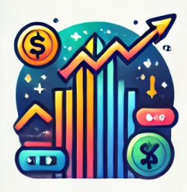
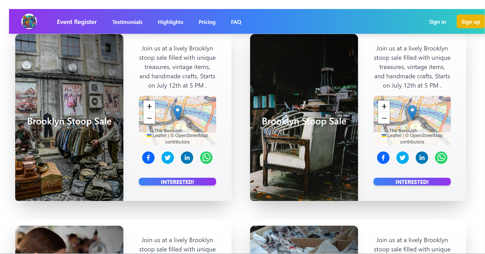

<!-- Improved compatibility of back to top link: See: https://github.com/othneildrew/Best-README-Template/pull/73 -->
<a id="readme-top"></a>
<!--
*** Thanks for checking out the Best-README-Template. If you have a suggestion
*** that would make this better, please fork the repo and create a pull request
*** or simply open an issue with the tag "enhancement".
*** Don't forget to give the project a star!
*** Thanks again! Now go create something AMAZING! :D
-->


<!-- PROJECT SHIELDS -->
<!--
*** I'm using markdown "reference style" links for readability.
*** Reference links are enclosed in brackets [ ] instead of parentheses ( ).
*** See the bottom of this document for the declaration of the reference variables
*** for contributors-url, forks-url, etc. This is an optional, concise syntax you may use.
*** https://www.markdownguide.org/basic-syntax/#reference-style-links
-->
[![Contributors][contributors-shield]][contributors-url]
[![Forks][forks-shield]][forks-url]
[![Stargazers][stars-shield]][stars-url]
[![Issues][issues-shield]][issues-url]
[![MIT License][license-shield]][license-url]
[![LinkedIn][linkedin-shield]][linkedin-url]

<div align="center" >
<h2 align="center">Challenge: 💌 Create an interactive invitation to a Brooklyn Stoop Sale using HTML/CSS/JavaScript. </h2>
</div>
<!-- PROJECT LOGO -->
<br />
<div align="center">
  <a href="https://github.com/gowthamdongari/Team_Curious_Stoop_Sale">
    
  </a>

  <h3 align="center">Brooklyn Stoop Sale</h3>

  <p align="center">
    This is a web Application built during the `Codedex` Hackathon For Brooklyn Stoop Sale
    <br />
    <a href="https://github.com/gowthamdongari/Team_Curious_Stoop_Sale"><strong>Explore the Project »</strong></a>
    <br />
    <br />
  </p>
</div>


<!-- TABLE OF CONTENTS -->
<details>
  <summary>Table of Contents</summary>
  <ol>
    <li>
      <a href="#about-the-project">About The Project</a>
      <ul>
        <li><a href="#built-with">Built With</a></li>
      </ul>
    </li>
    <li>
      <a href="#getting-started">Getting Started</a>
      <ul>
        <li><a href="#prerequisites">Prerequisites</a></li>
        <li><a href="#installation">Installation</a></li>
      </ul>
    </li>
    <li><a href="#usage">Usage</a></li>
    <li><a href="#roadmap">Roadmap</a></li>
    <li><a href="#contributing">Contributing</a></li>
    <li><a href="#license">License</a></li>
    <li><a href="#contact">Contact</a></li>
    <li><a href="#acknowledgments">Acknowledgments</a></li>
  </ol>
</details>


<!-- ABOUT THE PROJECT -->
## About The Project

[](https://github.com/gowthamdongari/Team_Curious_Stoop_Sale)


Welcome to the Brooklyn Stoop Sale project, a vibrant and interactive digital invitation designed to capture the essence of a classic Brooklyn neighborhood sale. This project challenges you to create an engaging web page using HTML, CSS, and JavaScript, with optional use of React for added complexity. The goal is to produce an invitation that not only informs but also delights potential attendees with interactive elements such as music, animations, and a dynamic map. The event features a variety of items for sale, including clothes, home goods, shoes, and tchotchkes, all set up on a table and clothing rack in the charming streets of Brooklyn, NY.

The project requires a creative approach to interactivity and aesthetics, ensuring that the invitation is shareable and visually appealing. You are encouraged to use modern web development tools and platforms such as Vercel or GitHub Pages for deployment, with the option to leverage Wix Studio for a low-code solution. Essential resources include Google Maps and Mapbox for integrating a location map, as well as comprehensive guides on HTML, CSS, and JavaScript provided by CodeDex. By merging these technologies and resources, you'll create an inviting and dynamic online experience that reflects the unique vibes of a Brooklyn stoop sale.


<p align="right">(<a href="#readme-top">back to top</a>)</p>


### Built With

This section has  major frameworks/libraries used  for project. 

<!-- * [![Next][Next.js]][Next-url] -->
* [![React][React.js]][React-url]
* [![Material-UI][Material-UI]]
* [![Tailwind CSS][Tailwind CSS]]
<!-- * [![Vue][Vue.js]][Vue-url] -->
<!-- * [![Angular][Angular.io]][Angular-url] -->
<!-- * [![Svelte][Svelte.dev]][Svelte-url] -->
<!-- * [![Laravel][Laravel.com]][Laravel-url] -->
<!-- * [![Bootstrap][Bootstrap.com]][Bootstrap-url] -->
<!-- * [![JQuery][JQuery.com]][JQuery-url] -->

<p align="right">(<a href="#readme-top">back to top</a>)</p>


<!-- GETTING STARTED -->
## Getting Started


To get a local copy up and running follow these simple steps.
```bash
git clone: https://github.com/gowthamdongari/Team_Curious_Stoop_Sale.git
```

<!-- ### Prerequisites

you need to use the software to install them follow these instructions.

* npm
  ```sh
  npm install
  ``` -->

### Installation

_Follow these steps to install and set up the application._

1. Clone the repo
   ```sh
   git clone https://github.com/gowthamdongari/Team_Curious_Stoop_Sale.git

   ```
3. Install NPM packages
   ```sh
   npm install
   ```
4. npm run dev to start locally
   ```sh
   npm run dev
   ``` 

<p align="right">(<a href="#readme-top">back to top</a>)</p>


<p align="right">(<a href="#readme-top">back to top</a>)</p>


<!-- ROADMAP -->
## Roadmap

<!-- - [x] Add Changelog
- [x] Add back to top links
- [ ] Add Additional Templates w/ Examples
- [ ] Add "components" document to easily copy & paste sections of the readme
- [ ] Multi-language Support
    - [ ] Chinese
    - [ ] Spanish -->

See the [open issues](https://github.com/othneildrew/Best-README-Template/issues) for a full list of proposed features (and known issues).

<p align="right">(<a href="#readme-top">back to top</a>)</p>


<!-- CONTRIBUTING -->
## Contributing

Contributions are what make the open source community such an amazing place to learn, inspire, and create. Any contributions you make are **greatly appreciated**.

If you have a suggestion that would make this better, please fork the repo and create a pull request. You can also simply open an issue with the tag "enhancement".
Don't forget to give the project a star! Thanks again!

1. Fork the Project
2. Create your Feature Branch (`git checkout -b feature/AmazingFeature`)
3. Commit your Changes (`git commit -m 'Add some AmazingFeature'`)
4. Push to the Branch (`git push origin feature/AmazingFeature`)
5. Open a Pull Request

<p align="right">(<a href="#readme-top">back to top</a>)</p>


<!-- LICENSE -->
## License

Distributed under the MIT License. See `LICENSE.txt` for more information.

<p align="right">(<a href="#readme-top">back to top</a>)</p>


<!-- CONTACT -->
## Contact

Gowtham Dongari - [@your_twitter](https://twitter.com/your_username) - gdongari@smu.edu

RamaKrishna Aruva - [@your_twitter](https://twitter.com/your_username) - Raruva@smu.edu

Project Link: [https://github.com/gowthamdongari/Team_Curious_Stoop_Sale.git](https://github.com/gowthamdongari/Team_Curious_Stoop_Sale.git)

<p align="right">(<a href="#readme-top">back to top</a>)</p>


<!-- ACKNOWLEDGMENTS -->
## Acknowledgments

resources used in this project !

<!-- * [Choose an Open Source License](https://choosealicense.com) -->
* [GitHub Emoji Cheat Sheet](https://www.webpagefx.com/tools/emoji-cheat-sheet)
<!-- * [Malven's Flexbox Cheatsheet](https://flexbox.malven.co/) -->
<!-- * [Malven's Grid Cheatsheet](https://grid.malven.co/) -->
* [Img Shields](https://shields.io)
* [GitHub Pages](https://pages.github.com)
* [Font Awesome](https://fontawesome.com)
* [React Icons](https://react-icons.github.io/react-icons/search)

<p align="right">(<a href="#readme-top">back to top</a>)</p>


<!-- MARKDOWN LINKS & IMAGES -->
<!-- https://www.markdownguide.org/basic-syntax/#reference-style-links -->
[contributors-shield]: https://img.shields.io/github/contributors/gowthamdongari/Team_Curious_Stoop_Sale.svg?style=for-the-badge
[contributors-url]: https://github.com/gowthamdongari/Team_Curious_Stoop_Sale/graphs/contributors
[forks-shield]: https://img.shields.io/github/forks/gowthamdongari/Team_Curious_Stoop_Sale.svg?style=for-the-badge
[forks-url]: https://github.com/gowthamdongari/Team_Curious_Stoop_Sale/network/members
[stars-shield]: https://img.shields.io/github/stars/gowthamdongari/Team_Curious_Stoop_Sale.svg?style=for-the-badge
[stars-url]: https://github.com/gowthamdongari/Team_Curious_Stoop_Sale/stargazers
[issues-shield]: https://img.shields.io/github/issues/gowthamdongari/Team_Curious_Stoop_Sale.svg?style=for-the-badge
[issues-url]: https://github.com/gowthamdongari/Team_Curious_Stoop_Sale/issues
[license-shield]: https://img.shields.io/github/license/gowthamdongari/Team_Curious_Stoop_Sale.svg?style=for-the-badge
[license-url]: https://github.com/gowthamdongari/Team_Curious_Stoop_Sale/blob/master/LICENSE.txt
[linkedin-shield]: https://img.shields.io/badge/-LinkedIn-black.svg?style=for-the-badge&logo=linkedin&colorB=555
[linkedin-url]: https://www.linkedin.com/in/gowthamdongari/

[product-screenshot]: images/screenshot.png
[Next.js]: https://img.shields.io/badge/next.js-000000?style=for-the-badge&logo=nextdotjs&logoColor=white
[Next-url]: https://nextjs.org/
[React.js]: https://img.shields.io/badge/React-20232A?style=for-the-badge&logo=react&logoColor=61DAFB
[React-url]: https://reactjs.org/
[Vue.js]: https://img.shields.io/badge/Vue.js-35495E?style=for-the-badge&logo=vuedotjs&logoColor=4FC08D
[Vue-url]: https://vuejs.org/
[Angular.io]: https://img.shields.io/badge/Angular-DD0031?style=for-the-badge&logo=angular&logoColor=white
[Angular-url]: https://angular.io/
[Svelte.dev]: https://img.shields.io/badge/Svelte-4A4A55?style=for-the-badge&logo=svelte&logoColor=FF3E00
[Svelte-url]: https://svelte.dev/
[Laravel.com]: https://img.shields.io/badge/Laravel-FF2D20?style=for-the-badge&logo=laravel&logoColor=white
[Laravel-url]: https://laravel.com
[Bootstrap.com]: https://img.shields.io/badge/Bootstrap-563D7C?style=for-the-badge&logo=bootstrap&logoColor=white
[Bootstrap-url]: https://getbootstrap.com
[JQuery.com]: https://img.shields.io/badge/jQuery-0769AD?style=for-the-badge&logo=jquery&logoColor=white
[JQuery-url]: https://jquery.com 
[Material-UI]: https://img.shields.io/badge/Material--UI-0081CB?style=for-the-badge&logo=material-ui&logoColor=white
[Material-UI-url]: https://material-ui.com/
[Tailwind CSS]: https://img.shields.io/badge/Tailwind_CSS-38B2AC?style=for-the-badge&logo=tailwind-css&logoColor=white
[Tailwind CSS-url]: https://tailwindcss.com/
